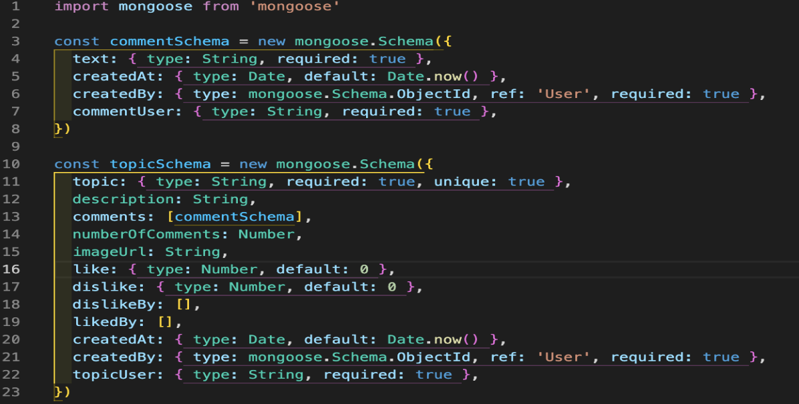

## **Project 3 - Backend and Front end application**

For project 3, we had to build a backend database and then use that database for our frontend website. It was a group project of 3 people. We decided to create a forum type website, similar to Reddit. For that reason we called our website ReadIT. Functionalities our website provides are: creating topics, adding comments, registering and logging in. Also, our home page had three topics filtered with conditions such as: most comments, most likes and latest topic. Furthermore, we had our Git and LinkedIn accounts linked in the footer. We had 7 days to complete this project.

[Link to the website](https://ga-readit.netlify.app/ "Link to the website")

### **Overview**
We had to create our own API in the backend and database using Node, Express, and MongoDB. Then, while building that, create a website in the frontend using React and JSX.

### **Technologies**

#### **Backend**
- Express.js
- MongoDB
- Node.js
- Nodemon

#### **Frontend**
- React
- SASS
- Bootstrap
- JSX

### **Day to day progress**

Day 1 

Firstly, while using Excalidraw we planned what endpoints we will be using for our backend API, drew out the pages and decided what Schemas we will need to use. Furthermore, I listed what js files we will need to create for the backend and frontend. Splitting the work was quite easy, we said which parts we want to work on individually, and if there were no objections, we would go ahead and do it.

Day 2 

We created a fully working backend with all endpoints and seeding data working. To check whether everything works, we used Insomnia to test it out. 
Here I created a topic.js file which consisted of topic and comment Schemas. I defined the structure of the data. 
While some have pretty clear meaning, some others that may not be as clear are: like and dislike. This is for liking and disliking functionality. It will display how many likes and dislikes a post has. Default value is 0 because we want to start off with 0 for each. DislikedBy and likedBy value was empty array, that was because in order for one user to not spam like or dislike buttons I had to turn it into empty array in order to use it in a function in which we tracked who pressed a like or a dislike, and if a user does that, they are not allowed to do it again. CreatedAt was there so it displays a time when topics and comments were created.

Then I created a user.js file. This file consisted of userSchema. I defined what structure the data will follow. Email, userName and password are required while apart from password, they have to be unique as well, to avoid users having the same username and/or email. 

Here I created an auth.js file, this was used to authenticate a token. 
Line 6 is storing a token by making a request, while line 7 is an error handler, which means that if the token was not found, an error message will be displayed.
Line 11 is for splitting the token and storing the middle part of the token in the token variable.
Line 13 is for verifying the token by installing and using jwt.verify while line 14 is checking to see whether the token is still valid and not expired and line below is in case the token has expired, then an error message would be displayed.

I then built an errorHandler.js file, this is for handling errors to prevent the server from crashing if these errors were to happen.
Line 4 is to handle an error that is caused by the user providing an incorrect object ID. 
Line 7 is when a user provides incorrect credentials for example when logging in and mistyping password and/or username.
Line 11 is when the token provided is not valid.
Line 15 is for errors that are server side errors, which oftentimes will be caused by us developing the server, for example making an error in the function.
Line 18 is for creating a title that is not unique on our website. For example, while creating a topic, using a title that was already used by someone else, in that instance this error message will be displayed.
Line 22 is for other errors that may not have been caught.

Here I created a topicController.js file which is handling all requests regarding topics. This is a get request for a single topic, if the topic is found it will be displayed, if not then an error message will be displayed instead.

This is a post request, it will allow a user to create a topic. If the user is not an admin or user, this means that they are not logged in, which means an error message will be displayed, otherwise the topic will be created and the username of the user and their id will be attached to the topic.

This is a delete request which will remove the topic. If the user is not an admin or a user who created the topic, an error message will be displayed saying “Forbidden”, otherwise the topic will be removed.

Here I created a userController.js file, this is for handling register and login functionality.
To handle the register function, I first created some error messages. If a user is trying to register and use an already taken email/username the error messages will be displayed and will not let the user to register. Furthermore, if a user does not provide a matching password and confirmPassword another error message will be displayed. Last error message is when a user leaves any input field empty, if that happens then an error message will appear. However, if all conditions are met without errors, the user's password will be bcrypted, as a means of security. It will add salt and will hash the password, so it would be protected from data leaks of the server.

This is a login function, I am first sending a request to the body. This will allow me to check whether the user has created an account or credentials are correct. This is what lines 38 and 39 are checking. If a username is not found in the database, it means either the spelling is incorrect, or the user hasn't created an account with that username.
Same is being done on line 42 and 43. 
Finally, we are setting the token to be assigned to a user's username and email address once they login, and expiry date is in 2 days. Then we are signing the token by using jsw.sign.

Day 3 
We finished the backend the previous day, so at this point we moved on to the frontend. Due to me working on login, register, and auth in the backend, we decided that it would be the best that I would work on these in the frontend as well. Firstly, I used ‘useState’ where I stored data for login data and error data. Also, I used navigate which allowed me to navigate to a different API endpoint in the event of logging in, and registering. I used the ‘handleChange’ function, this allowed me to display the input of a user on the screen. Also, once a user tried to submit and there was an error, it would be displayed in the error field, so this function allowed me to remove the error box once the user starts typing, because errors would be set to false. 

Here I am making an ‘onSubmit’ function. This will be a function used when information is submitted, e.g when logging in, in or registering.
In the try block we are sending a post request and setting the token and username in the local storage while also setting the token in the header. Then we navigate to the home page.
In the catch block we are catching errors, and storing error messages in ‘errors useState’ which then we will be able to display it for the user.

Functionality is the same as a Login component, but without setting a token to the local storage. I use `navigate` here as well, if the post request is successful, the user will be taken to the login page.

Here I am using `useEffect` to render the token if it exists in the local storage, so the user can remain logged in, even if they reload or close the page. If a token exists it will be added to the header, otherwise it will be null.

Day 4, 5, 6 

I moved on to do styling for those three days. For the navbar I used bootstrap, but for the remaining pages, I used SASS. While doing styling, I would be giving a helping hand to my group mates as well if they came across any errors or were stuck at some point. 

Navbar - I displayed our page icon, name, and links to different pages.

Single topic page - at the top, we display the name of the user who created the topic, below that, it’s the title, in the middle it's the image, and at the bottom we have the description. We also have like and dislike buttons for the topic, where everyone with an account can react to, and the user can delete the topic if they chose to do so. Then we have the comments, and delete, and edit buttons for the owner of the comment. At the very bottom we have a comment box, where new comments can be added.

Register - here is the registration form, with all of the required fields. The button has a hover effect, which means it changes colour once a user hovers on it or over it. 

Login - it has the same structure and effects as register.

Day 7 

We used this day to check and fix any bugs we came across. Once that was sorted, we deployed the front end and back end separately.

### **Key Learnings**
- How to build the back end from scratch while using MongoDB.
- How to keep a user logged in by using `axios.defaults.headers.common`
- How to set error messages in the back end and then display them in the front end.
- How to work in a team.

### **Challenges**
- When working in the group, we should keep spelling consistent, we had an error which took a while to fix because in User Schema I set username as `username` which I used in Topic Controller as such, while my group mate used it as `userName` in other parts of the back end, so we changed the Schema to `userName` and updated the spelling in all components, but didn’t change it in Auth Component.
- It took a significant amount of time to keep a user logged in once the page was closed or refreshed. Had to do a lot of research to get this working.

### **Wins**
- We built a fully working app that did not have any functionality issues.

### **Bugs**
- Mobile support for the website is quite poor.

### **Future improvements**
- Add edit topic functionality to the front end, it has been added in the back end.
- Add likes and dislikes for comments.
- Could potentially add a thread if another user wants to reply to someone else's comment, for better user interface.